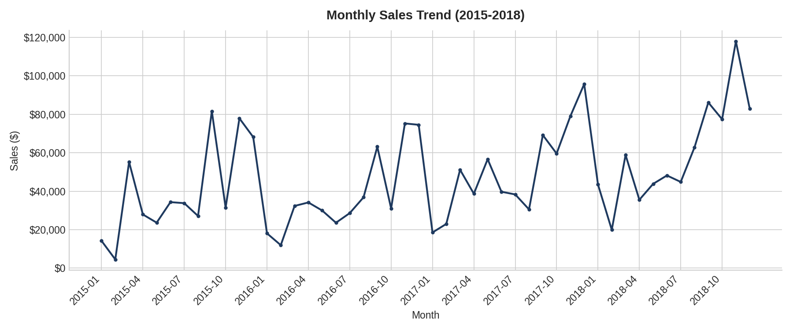
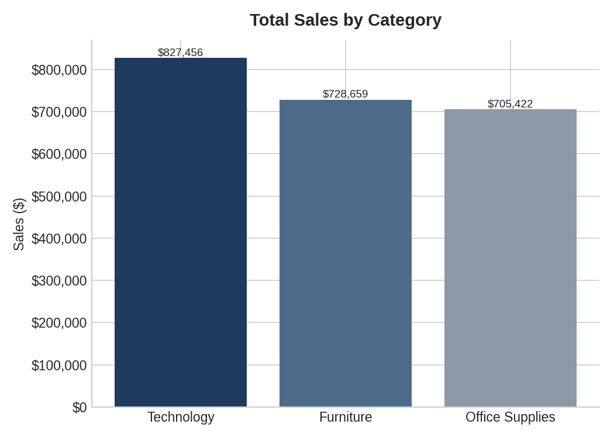
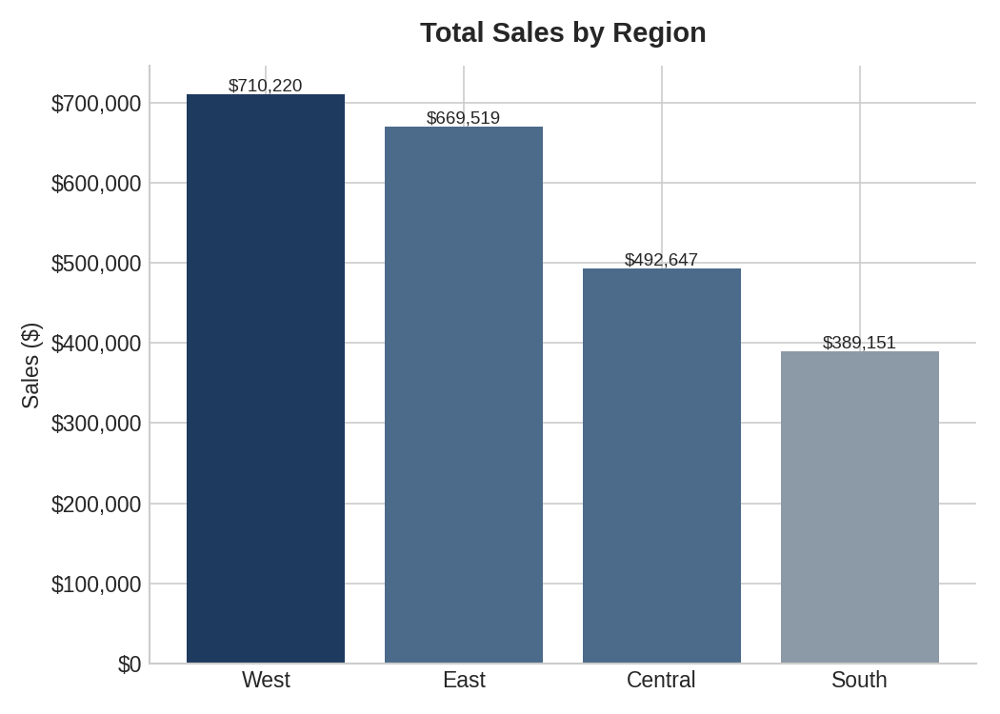
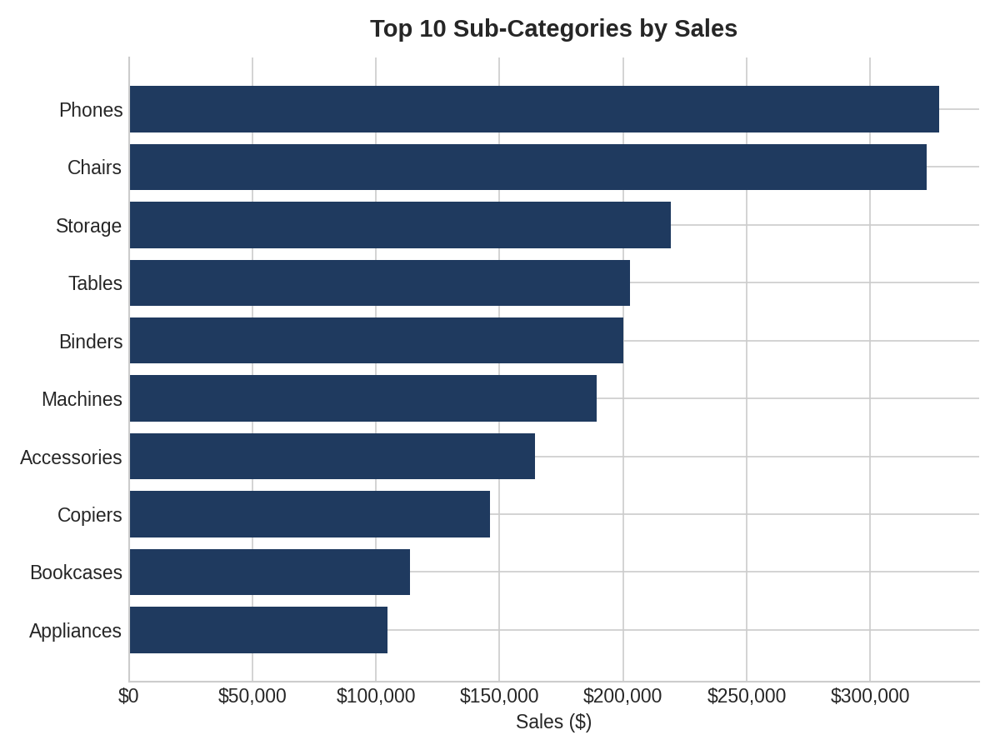
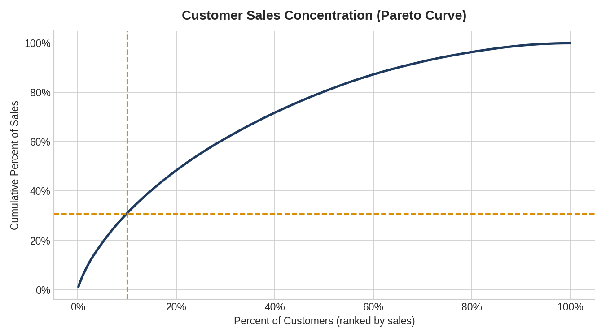

# Superstore Sales Analysis

Analysis of four years (2015-2018) of retail sales transactions to uncover
revenue trends, seasonality, and customer concentration patterns.

## Overview

This project explores the Superstore sales dataset (9,800 transactions) to
answer key business questions: How is revenue trending over time? Which
categories, regions, and customers drive the most sales? Is the business
overly reliant on a small number of customers?

## Data Cleaning

- Parsed `Order Date` and `Ship Date` from day/month/year text format into
  proper datetime objects
- Checked for duplicate `Order ID` + `Product ID` combinations (8 pairs found
  and reviewed individually rather than dropped automatically)
- Engineered `Year`, `Month`, and `Ship Days` (delivery time) columns

## Key Findings

- **Growth trend:** Total sales grew from ~$480K (2015) to ~$722K (2018),
  with a ~4% dip in 2016 followed by 30% growth in 2017 and 20% in 2018.
- **Seasonality:** November 2018 was the strongest month by far, pointing to
  a clear holiday sales effect.
- **Category leader:** Technology was the top-selling category, narrowly
  ahead of Furniture and Office Supplies.
- **Regional gap:** The West region significantly outperformed others, with
  the South trailing well behind.
- **Customer concentration:** Revenue is fairly distributed, but the top 10%
  of customers (~79 people) account for nearly a third of total sales.

## Visualizations

| Chart | Description |
|---|---|
|  | Monthly sales trend, 2015-2018 |
|  | Total sales by category |
|  | Total sales by region |
|  | Top 10 sub-categories by sales |
|  | Customer sales concentration (Pareto curve) |

## Project Structure

```
superstore-sales-analysis/
    README.md
    data/
        raw/train.csv
        processed/superstore_clean.csv
    scripts/
        01_data_cleaning.py
        02_exploratory_analysis.py
        03_visualizations.py
    outputs/
        (5 chart PNGs)
```

## Tools

Python, pandas, matplotlib

## How to Run

1. Place the raw dataset in `data/raw/train.csv`
2. Run `scripts/01_data_cleaning.py` to produce the cleaned dataset
3. Run `scripts/02_exploratory_analysis.py` to print summary statistics
4. Run `scripts/03_visualizations.py` to generate the charts in `outputs/`
